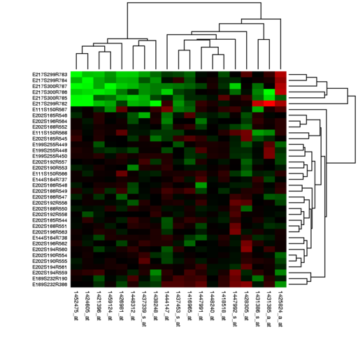
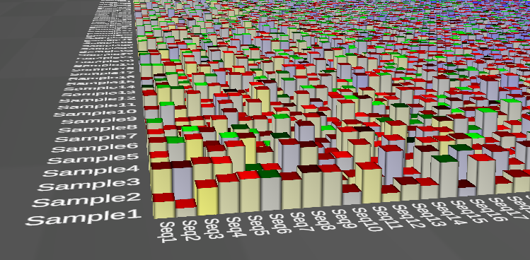

# 3D Heatmap

3D Heatmap is a project of

    Idea Factory
    Institute for Biomedical Informatics (IBI)
    Perelman School of Medicine
    University of Pennsylvania

    Director: Dr. Jason Moore
    Lead Developer: Michael Stauffer (stauffer@upenn.edu)

# Overview

3D Heatmap is a program for simultaneoulsy visualizing up to three dimensions of independent variables (Feature Values, using the terminology from machine learning) against two independent variables (Sample and Feature sets).

The goal is to provide a better way to find relationships between multiple dependent variables, in particular for large data sets where viewing three conventional 2D heatmaps side by side can become very awkward.

### Example of Appropriate data

An example of an appropriate data set is one in which gene expression (the Feature Value, or independent variable) is measured for a number of different genes (the Feature Set, or first independent variable) across different cell lines (the Sample Set, or second independent variable), under three different environmental conditions - thus generating a three-dimensional Feature Value set. Typically these would be displayed using three separate 2D heatmaps, one for each environmental condition. Using the 3D Heatmap tool, these three conditions can be visualized in one map.

You can load a demo data set from the user interface to play around with things.

### VR support

Basic VR support is provided for SteamVR-capable devices. VR can make for easier viewing of large data sets. [See below](#VRsupport) for more details.

### System Requirements

The project is built in Unity, and can be compiled for Windows, MacOS and (probably) Linux, Android and iOS (hasn't been tried yet). The main system limitation will be memory requirements for very large data sets - you'll just have to try it and see if it works. 

### Data Format

The program can read data in either csv or tab-delimited formats. [See below](#FileFormat) for more details.

### Call for Data

As we develop this project, we are looking for data sets from researchers and clinicians that might benefit from this new tool. We'd like to try the tool with your data to learn how it may help your visualization needs.

### Contributing and Suggestions
If you'd like to contribute to the project, or have suggestions, [let us know!](mailto:stauffer@upenn.edu), and check out the [Developer Stuff](#DevStuff)

### License
MIT License. See LICENSE doc in repo.

# Motivation for Developing 3D Heatmap

### Conventional 2D Heatmaps

A conventional heat map consists of a 2D grid of colored squares where each square represents an observation of a single (1D) dependent variable (Feature Value) for a given pair of members of two independent variables (Sample and Feature sets)The color of the square is proportional to the Feature Value. 2D heat maps are used pervasively in the Biological sciences and the Samples, Features, and Feature Values can represent a variety of concepts. The rows and columns of the grid consist of Sample and Feature sets, which may represent genes, experimental conditions, subjects, genomic elements, etc. The observed Feature Value in each grid is shown using a color palette, and may represent transcript abundance, protein concentration, conservation, activation, etc.

### Visualizing Multiple Dimenions

However, it is often desirable to map several dimensions of Feature Values. This situation is usually resolved by plotting a separate 2D heat map for each dimension. The analysis of relationships between multiple dimensions is usually hindered by this design due to the loss of context and orientation when transitioning between dimensions in large data sets. It is our goal to explore alternative representations that superimpose and interleave several dimensions onto the same grid. Through this approach we aim to find a solution that decreases the disorienting effect of transitioning between dense and separately graphed volumes of data and to increase the interpretability of multidimensional data without overwhelming the user's senses.

### 3D Heatmap example

Here is an example of the tool in its current form.

Each block represents three Feature Values, one each shown by block height, side color and top color.

# Usage Instructions

### File Format

The program expects each Feature Value (dependent variable) from a separate text file of 2D array data: 
- Either csv or tab-delimited formats. 
- Headers for Rows and/or Columns are supported, as well as no headers.
- Each data file must have the same data dimensions.
- Files can contain NaN values (e.g. "Nan", "NA", "N/A", "nan", etc). See source code for full list. 
- Currently only numerical data values are supported. Everything is read in as type float. 
- Naturally, the independent variables reprented by the columns and rows are expected to be the same or otherwise compatible between the files.

### Loading and Viewing Data

1. Click _Demo Data_ button in the bottom left of the user interface to view some demo data. Otherwise...
1. Under _Data Variables_ in the GUI on the left, select and load your data files
1. Under _Visual Mappings_, assign the variables to each of Height, Top Color, and Side Color.
1. Choose color tables for Top and Side colors.
1. Click the Redraw button, or press F2.

### View Controls

||Mouse|Touch|Keyboard|
|---|---|---|---|
|**Move**|left-click & drag|two-finger drag|arrow keys|
|**Rotate**|right-click & drag|three-finger drag| ctrl + arrows|
|**Zoom**|scroll wheel, or two-finger touchpad up/down|two-finger pinch|shift + arrows, or +/- keys|

### Inspecting Data
As the mouse pointer hovers over a data block, it will flash and a heads-up display will show the data values for that block. If you single-click on a block, it will stay highlighted as you move the mouse pointer. To resume continuous inspection as the mouse pointer moves, click anywhere off of the data graph.

In VR mode, you can inspect data by pulling the trigger button and pointing at the blocks.

# VR Support

SteamVR/OpenVR devices are supported for viewing in VR.

It's easiest to setup your headset being launching the app, and it will enter VR mode automatically if your headset is detected.
You can connect your headset after you've lanuched the app, in which case press the "Enable" button in the VR menu panel.

For now, data must be set up and controlled from the desktop.

### Controls
- Hold the controller's grip button to move the data in all direction.
- Use the trigger to inspect data blocks

### Desktop View Options
In VR mode, the desktop window can display can operate in two modes, controlled by the _Desktop View_ setting in the VR menu panel:
- display the headset's view, or 
- display an independent view that's controlled by the desktop user

# Developer Stuff

### Unity
As of Sept. 2019, the 3D Heatmap project has been developed in Unity 2018.2.1f1. Why not Unity 2019? Inertia. And maybe some things will break, we don't know yet.

### Simple Model View
The project uses a small UI toolkit called _Simple Model View_, also developed at the Idea Factory. It provides a simplified Model-View framework for easier sychronization between program-logic variables and UI objects. It lives here on github: (https://github.com/EpistasisLab/SimpleModelView)
If you have any improvments to contribute to this project, that'd be great.

### CSV File Reading
The CSV file reader is largely homegrown as well, see _CSVReader_ folder within the Unity project Assets folder. It doesn't have its own github repo.

### File Picker
We use the [Standalone File Browser](https://github.com/gkngkc/UnityStandaloneFileBrowser) project (in its own folder in the project Assets folder) to supply a file picker. It works well for Windows and Mac, but I haven't tested on Linux.

### WebGL Support
The project builds for WebGL, but fails with a memory error when the file picker opens. I haven't tried it beyond that.

It'd be great to have a WebGL build for easier distribution and updating for users.

There's an alternative file browser project that may work better with WebGL: (https://assetstore.unity.com/packages/tools/utilities/file-browser-free-98716)

### Demo Data
The demo data that's loaded when you click the _Demo Data_ button in the UI is stored in Streaming Assets folder.