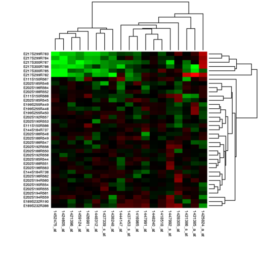

 3D Heatmap

3D Heatmap is a project of

    Idea Factory
    Institute for Biomedical Informatics (IBI)
    Perelman School of Medicine
    University of Pennsylvania

    Director: Dr. Jason Moore
    Lead Developer: Michael Stauffer

# Call for Data

As we develop this project, we are looking for data sets from researchers and clinicians that might benefit from this new tool.

Such data will have 2 or 3 (or possibly as many as 5) feature values (aka observations, or dependent variables) instead of the single feature value shown in a conventional heatmap. For example, a data set that you may visualize using 3 conventional heatmaps side-by-side. With our 3D Heatmap tool, all the feature values are displayed on one map.

## Speculative Example of Appropriate data

Thinking speculatively, an appropriate data set would be one in which gene expression (the feature set) is measured for a number of cell lines (the sample set), under three different environmental conditions, thus generating a three-dimensional feature value set. Typically these would be displayed using three separate 2D heatmaps, one for each environmental condition. Using the 3D Heatmap tool, these three conditions can be visualized in one map.

## Data Format

We can accept data in the common csv and tab-delimited formats.

# Motivation for Developing 3D Heatmap

ORIG text to review and maybe take from:

A conventional heat map consists of a 2D grid of colored squares where each square represents an observation of a single (1D) dependent variable (Feature Value) for a given pair of members of Sample and Feature sets. The color of the square is proportional to the Feature Value. 2D heat maps are used pervasively in the Biological sciences and the Samples, Features, and Feature Values can represent a variety of concepts. The rows and columns of the grid consist of Sample and Feature sets, which may represent genes, experimental conditions, subjects, genomic elements, etc. The observed Feature Value in each grid is shown using a color palette, and may represent transcript abundance, protein concentration, conservation, activation, etc.

However, it is often desirable to map several dimensions of Feature Values. This situation is usually resolved by plotting a separate 2D heat map for each dimension. The analysis of relationships between multiple dimensions is usually hindered by this design due to the loss of context and orientation when transitioning between dimensions in large data sets. It is our goal to explore alternative representations that superimpose and interleave several dimensions onto the same grid. Through this approach we aim to find a solution that decreases the disorienting effect of transitioning between dense and separately graphed volumes of data and to increase the interpretability of multidimensional data without overwhelming the user's senses.

## Conventional 2D Heatmaps

A conventional heat map consists of a 2D grid of colored squares where each square represents an observation of a single (1D) dependent variable (Feature Value) for a given pair of members of Sample and Feature sets. The color of the square is proportional to the Feature Value. 2D heat maps are used pervasively in the Biological sciences and the Samples, Features, and Feature Values can represent a variety of concepts. The rows and columns of the grid consist of Sample and Feature sets, which may represent genes, experimental conditions, subjects, genomic elements, etc. The observed Feature Value in each grid is shown using a color palette, and may represent transcript abundance, protein concentration, conservation, activation, etc.

2D Heatmap example, by Miguel Andrade at English Wikipedia

## Visualizing Multiple Dimenions

However, it is often desirable to map several dimensions of Feature Values. This situation is usually resolved by plotting a separate 2D heat map for each dimension. The analysis of relationships between multiple dimensions is usually hindered by this design due to the loss of context and orientation when transitioning between dimensions in large data sets. It is our goal to explore alternative representations that superimpose and interleave several dimensions onto the same grid. Through this approach we aim to find a solution that decreases the disorienting effect of transitioning between dense and separately graphed volumes of data and to increase the interpretability of multidimensional data without overwhelming the user's senses.

# Current 3D Heatmap example

Below is an example of the tool in its current form.
